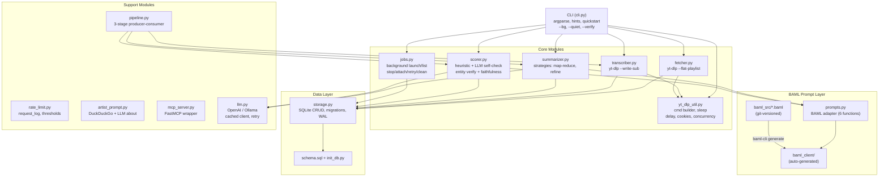
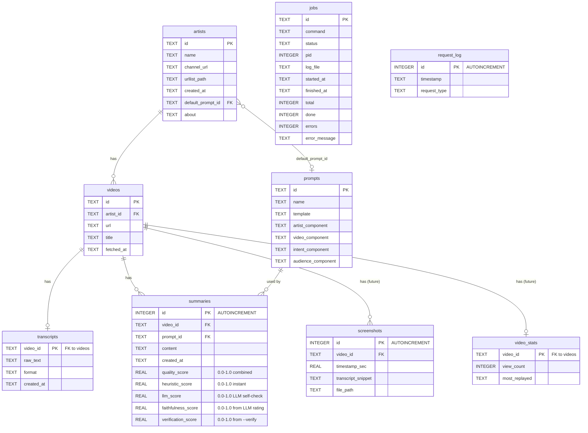
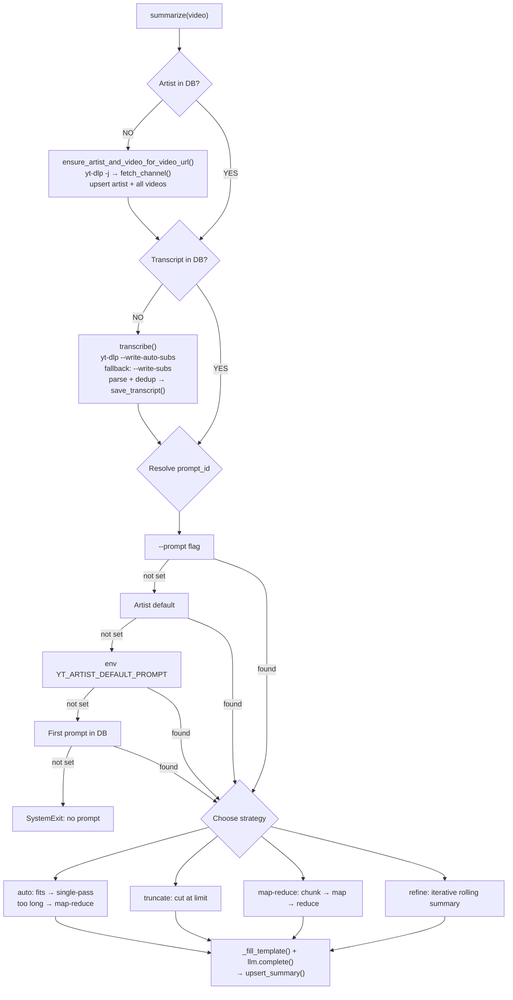
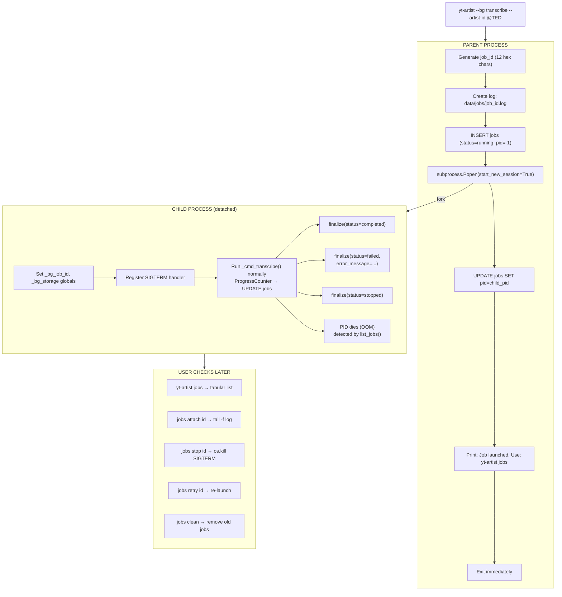
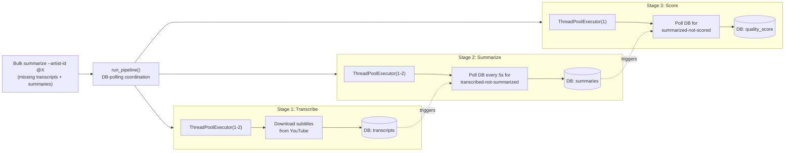
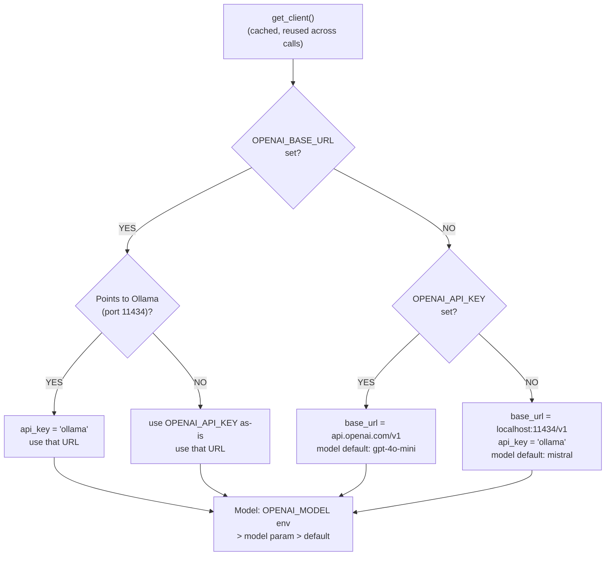

# yt-artist Architecture Diagrams

## 1. High-Level Module Dependency Graph



## 2. Data Flow: End-to-End Pipeline

```
  YouTube Channel URL
         |
         v
  +------+-------+     yt-dlp --flat-playlist -j
  |  fetch_channel|----------------------------------+
  +------+-------+                                   |
         |                                           |
         | NDJSON entries                             |
         v                                           v
  +------+-------+                          +--------+-------+
  | Write urllist |                          | Upsert Artist  |
  | markdown file |                          | Upsert Videos  |
  +--------------+                           +--------+-------+
                                                      |
                                                      v
  For each video (parallel, 2 workers):     +--------+-------+
                                            |  transcribe()  |
  +-----------------------------------------+  yt-dlp        |
  |                                         |  --write-sub   |
  |  1. Download subtitles to temp dir      |  --skip-download|
  |     (auto-subs first, manual fallback)  +--------+-------+
  |  2. Parse VTT/SRT -> plain text                  |
  |  3. Deduplicate consecutive lines                |
  |  4. Save to transcripts table                    |
  |  5. (Optional) write .txt file                   |
  |  6. Update ProgressCounter (+ jobs DB if --bg)   |
  +--------------------------------------------------+
                                                      |
                                                      v
  For each video (parallel, 2 workers):     +--------+-------+
                                            |  summarize()   |
  +-----------------------------------------+                |
  |  1. Load transcript from DB             |  Strategy:     |
  |  2. Choose strategy:                    |  auto/truncate/|
  |     - auto (default): single-pass       |  map-reduce/   |
  |       if fits, map-reduce if too long   |  refine        |
  |     - truncate: legacy (cut at limit)   +--------+-------+
  |     - map-reduce: chunk -> map -> reduce         |
  |     - refine: iterative rolling summary          |
  |  3. Load prompt template                         |
  |  4. Fill {artist},{video},{intent},{audience}     |
  |  5. BAML prompt via prompts.py (cached client)   |
  |  6. Upsert to summaries table                    |
  |  7. Update ProgressCounter (+ jobs DB if --bg)   |
  +--------------------------------------------------+
                                                      |
                                                      v
  For each summary (parallel, N workers):   +--------+-------+
                                            |  score()       |
  +-----------------------------------------+                |
  |  1. Load summary + transcript from DB   |  Heuristic +   |
  |  2. Heuristic score (instant, 5 subs):  |  LLM self-     |
  |     - Length ratio         (0.25)        |  check +       |
  |     - Repetition detection (0.15)        |  entity verify |
  |     - Key-term coverage    (0.25)        +--------+-------+
  |     - Structure analysis   (0.15)                 |
  |     - Named entity verify  (0.20)                 |
  |  3. LLM self-check (1 call, BAML typed):          |
  |     - ScoreSummary -> ScoreRating                  |
  |     - completeness, coherence, faithfulness 1-5    |
  |     - Uses _sample_transcript (start/mid/end)      |
  |     - faithfulness tracked separately in DB        |
  |  4. Combined: 0.4*heuristic + 0.6*llm             |
  |  5. (Optional) --verify: claim verification        |
  |     - VerifyClaims BAML -> ClaimVerification[]     |
  |     - 1 extra LLM call, verification_score in DB   |
  |  6. Update summaries table with all scores         |
  +----------------------------------------------------+
```

## 3. Data Model (Entity Relationship)



Indexes: `idx_videos_artist_id`, `idx_summaries_video_id`, `idx_summaries_prompt_id`, `idx_screenshots_video_id`, `idx_jobs_status`, `idx_request_log_timestamp`. Summaries has `UNIQUE(video_id, prompt_id)`.

## 4. CLI Command Dispatch

```
  yt-artist [--bg] [-q] [--dry-run] <command> [args]
         |
         +-- --bg? --> launch_background() --> detached child --> exit
         |
         +-- --_bg-worker? --> set globals, SIGTERM handler, wrap in crash safety
         |
         v
  +------+------+
  |  argparse   |
  |  dispatcher |
  +------+------+
         |
   +-----+-----+-----+-----+-----+-----+-----+-----+-----+-----+-----+-----+
   |     |     |     |     |     |     |     |     |     |     |     |     |
   v     v     v     v     v     v     v     v     v     v     v     v     v
  fetch  url  trans  sum  score add   list  set   build search quick jobs status
  chan.  list  cribe  mar        prom  prom  def.  art.  trans  start      doctor
              ize    ize        pt    pts   prom  prom  cripts
                                                        |
                                                  +-----+-----+-----+
                                                  |     |     |     |
                                                  v     v     v     v
                                                 list  attach stop  retry
                                                       clean

  Each command handler: _cmd_<name>(args, storage, data_dir)
  After each command: _hint() prints next-step to stderr (unless -q)

  Notable flags:
    score --verify    Run claim verification (1 extra LLM call per summary)
    score --skip-llm  Heuristic-only scoring (zero LLM calls)
```

## 5. Dependency Auto-Creation Chain



## 6. Background Job Lifecycle



## 7. Parallel Execution Model

```
  Bulk transcribe/summarize/score --artist-id @TED
       |
       +-- Batch query: find remaining items to process
       +-- Filter: N items remaining
       +-- maybe_suggest_background(N, "command", ...)
       |     --> stderr: "This will process N items (~Xm). Try --bg"
       |
       v
  ThreadPoolExecutor(max_workers=concurrency)     # --concurrency flag, default 2
       |
       +-- Worker 1:                    +-- Worker 2:
       |   item_1 -> process()          |   item_2 -> process()
       |   sleep(inter_video_delay)     |   sleep(inter_video_delay)
       |   item_3 -> process()          |   item_4 -> process()
       |   ...                          |   ...
       |                                |
       +-- Both update shared _ProgressCounter (thread-safe via Lock)
       |     +-- counter.tick() increments done/errors
       |     +-- If bg mode: UPDATE jobs SET done=?, errors=?
       |
       v
  All futures complete
       +-- progress.finalize(status='completed')
       +-- Print: "Done: N/N (0 errors)"
       +-- _hint(): context-aware next step

  All bulk commands use this pattern: transcribe, summarize, score.
  Score additionally prints per-item detail (quality, faithfulness, verification).

  Nested parallelism in map-reduce:
       +-- Outer: bulk summarize workers (max_workers=2)
       +-- Inner: map-reduce chunk workers (max_workers=_MAP_CONCURRENCY=3)
       +-- Total threads bounded: outer × inner = 6 max
```

## 8. Pipeline Parallelism (3-Stage)



Key design decisions:
- DB-polling (not queue): simpler, idempotent, crash-recoverable
- Poller checks every 5s, wakes up in 0.5s increments for responsive shutdown
- Concurrency budget split: e.g., 2 total → 1 transcribe + 1 summarize
- Stage 3 runs single-worker (scoring calls are tiny)
- Pipeline only activates when bulk summarize finds missing transcripts
- Standalone transcribe/summarize commands unchanged

## 9. Long-Transcript Summarization Strategies

```
  summarize() receives transcript
       |
       +-- len(raw_text) <= MAX_TRANSCRIPT_CHARS (30K)?
       |      |
       |      YES --> Single-pass: one LLM call (all strategies)
       |      |
       |      NO --> Strategy dispatch:
       |
       +-- auto (default):
       |      --> map-reduce (see below)
       |
       +-- truncate:
       |      --> Cut at MAX_TRANSCRIPT_CHARS, single LLM call
       |
       +-- map-reduce:
       |      |
       |      +-- _chunk_text(): split at sentence boundaries (~30K each)
       |      |     +-- Overlap: 500 chars (clamped to chunk_size/2)
       |      |     +-- Boundaries: ". ", "\n", "? ", "! "
       |      |
       |      +-- MAP: summarize each chunk in parallel (ThreadPoolExecutor)
       |      |     +-- "Summarize section {i} of {n}..."
       |      |     +-- N LLM calls (e.g., 5 for 150K chars)
       |      |     +-- Concurrency: _MAP_CONCURRENCY (default 3, env YT_ARTIST_MAP_CONCURRENCY)
       |      |     +-- Results reassembled in original chunk order
       |      |
       |      +-- REDUCE: concatenate chunk summaries
       |      |     +-- Fits context? --> one final LLM call
       |      |     +-- Still too long? --> recursive reduce
       |      |
       |      +-- Total: N + 1 LLM calls (+ recursive if needed)
       |
       +-- refine:
              |
              +-- _chunk_text(): same splitting logic
              |
              +-- Chunk 1 --> summarize --> initial summary
              +-- Chunk 2 --> "Previous summary: {prev}\nNew section: {chunk}" --> refined
              +-- Chunk 3 --> "Previous summary: {prev}\nNew section: {chunk}" --> refined
              +-- ...
              +-- Final refined summary is output
              |
              +-- Total: N LLM calls (strictly sequential)
              +-- Best coherence for narrative content
```

## 10. Quality Scoring Architecture

```
  score_summary(summary, transcript, skip_llm=False, verify=False)
       |
       +-- HEURISTIC (instant, zero LLM cost)
       |      |
       |      +-- _length_ratio_score():    summary/transcript length  (weight: 0.25)
       |      |     +-- Ideal: 0.02-0.10
       |      |     +-- Too short = under-summarized, too long = regurgitation
       |      |
       |      +-- _repetition_score():      duplicate sentence detection (weight: 0.15)
       |      |     +-- High repetition = model looping
       |      |
       |      +-- _key_term_coverage():     top-N terms from transcript (weight: 0.25)
       |      |     +-- Extract frequent words, check % in summary
       |      |
       |      +-- _structure_score():       multi-sentence, bullets     (weight: 0.15)
       |      |     +-- Single-line for 2hr episode is suspect
       |      |
       |      +-- _named_entity_score():    proper noun verification    (weight: 0.20)
       |      |     +-- Regex-extract multi-word names ("Elijah Wood", "Stanford")
       |      |     +-- Filter _ENTITY_STOPWORDS (months, days, sentence-start words)
       |      |     +-- Check each entity against transcript (case-insensitive)
       |      |     +-- Return verified_count / total (1.0 if no entities)
       |      |     +-- Hallucinated name → entity score ≈ 0.0 → pulls heuristic down
       |      |
       |      +-- heuristic_score = weighted average --> 0.0-1.0
       |
       +-- skip_llm? --> quality_score = heuristic_score (done)
       |
       +-- LLM SELF-CHECK (1 call via BAML ScoreSummary)
       |      |
       |      +-- _sample_transcript(transcript, max_excerpt=3000):
       |      |     +-- Short (≤ 3000): return whole text
       |      |     +-- Long: ~1000 chars each from start, middle, end
       |      |     +-- Joined with [...] markers between segments
       |      |     +-- Replaces old transcript[:3000] blind truncation
       |      |
       |      +-- prompts.score_summary() → typed ScoreRating:
       |      |     +-- completeness (1-5), coherence (1-5), faithfulness (1-5)
       |      |     +-- BAML handles JSON parsing — no manual _parse_llm_rating()
       |      |
       |      +-- llm_score = (completeness + coherence + faithfulness) / 15
       |      +-- faithfulness_score = faithfulness / 5 (tracked separately!)
       |      +-- On LLM failure: fall back to heuristic-only
       |      +-- faithfulness ≤ 0.4 → log.warning + CLI [!LOW FAITHFULNESS]
       |
       +-- quality_score = 0.4 * heuristic + 0.6 * llm --> 0.0-1.0
       |
       +-- verify=True? (opt-in via --verify flag)
       |      |
       |      +-- CLAIM VERIFICATION (1 extra LLM call via BAML VerifyClaims)
       |      |     +-- _sample_transcript(transcript, max_excerpt=6000)
       |      |     +-- prompts.verify_claims() → ClaimVerification[]
       |      |     +-- Each claim: {claim: str, verified: bool}
       |      |     +-- verification_score = verified_count / total_claims
       |      |
       |      +-- On LLM failure: verification_score = None (non-fatal)
       |
       +-- Store: UPDATE summaries SET quality_score=?, heuristic_score=?,
       |          llm_score=?, faithfulness_score=?, verification_score=?
```

## 11. Connection Management Pattern

```
  Every Storage method:

    def some_method(self, ...):
        conn = self._conn()        # New connection per call
        try:                        # WAL mode enables concurrent readers
            conn.execute(...)
            conn.commit()           # Commit per call
        finally:
            conn.close()            # Close immediately

  Result: N methods = N connections opened/closed
  WAL mode: foreground reads while background writes (jobs progress)
```

## 12. LLM Client Decision Tree



Client cache invalidated when env vars change between calls. Retry with exponential backoff on transient LLM failures.

## 13. Onboarding Flow

```
  User runs any command (first time, empty DB)
       |
       +-- is_first_run()? (no artists in DB)
       |      |
       |      YES --> stderr: "First time? Try: yt-artist quickstart"
       |
       +-- Execute command
       |
       +-- --quiet set? --> skip hints
       |
       +-- Print context-aware hint to stderr:
              |
              +-- fetch-channel --> "Next: yt-artist transcribe --artist-id @X"
              +-- transcribe (single) --> "Next: yt-artist summarize <video_id>"
              +-- transcribe (bulk) --> "Next: yt-artist summarize --artist-id @X"
              +-- summarize (single) --> "Try bulk: summarize --artist-id @X"
              +-- summarize (bulk) --> "Next: yt-artist score --artist-id @X"
              +-- score --> "Check: yt-artist status"
              +-- add-prompt --> "Next: set-default-prompt --prompt <id>"
              +-- set-default-prompt --> "Next: summarize --artist-id @X"

  Hints include real data: actual artist IDs, video IDs, counts.
  All hints go to stderr. stdout is clean for piping.
```

## 14. Rate-Limit Safety Stack

```
  Layer 1: yt-dlp flags (per request)
       +-- --sleep-requests 1.5s   (YT_ARTIST_SLEEP_REQUESTS)
       +-- --sleep-subtitles 2s    (YT_ARTIST_SLEEP_SUBTITLES)

  Layer 2: Inter-video delay (per video in bulk)
       +-- time.sleep(2.0s)        (YT_ARTIST_INTER_VIDEO_DELAY)

  Layer 3: Concurrency cap (parallel workers)
       +-- max_workers = 2          (YT_ARTIST_MAX_CONCURRENCY)

  Layer 4: Subtitle strategy (reduce requests)
       +-- Try auto-subs first (most videos have these)
       +-- Fallback to manual subs only if auto fails

  Layer 5: HTTP 429 backoff (per request)
       +-- Exponential backoff: 5s -> 10s -> 20s -> 60s cap
       +-- Max 3 retries before aborting

  Layer 6: Rate-limit monitoring (request_log table)
       +-- Log every yt-dlp request with timestamp
       +-- Warn at 200/hr and 400/hr thresholds
       +-- Auto-cleanup logs older than 24h
       +-- `yt-artist status` shows request counts

  Layer 7: Cookie support (avoid auth failures, higher rate limits)
       +-- YT_ARTIST_COOKIES_BROWSER=chrome
       +-- YT_ARTIST_COOKIES_FILE=/path/to/cookies.txt
       +-- Strongly recommended for 50+ video bulk transcription

  All layers configurable via environment variables.
  Defaults are conservative: safe for 500+ video channels.
```

## 15. BAML Prompt Architecture

```
  Source of Truth (git-versioned):

  baml_src/
       |
       +-- clients.baml         Ollama + OpenAI client configs
       |                        Exponential retry policy
       |
       +-- summarize.baml       4 prompt functions:
       |     +-- SummarizeSinglePass(transcript, artist, video_title) -> string
       |     +-- SummarizeChunk(chunk, chunk_index, total_chunks) -> string
       |     +-- ReduceChunkSummaries(section_summaries) -> string
       |     +-- RefineSummary(prev_summary, chunk, chunk_index, total_chunks) -> string
       |     +-- All include anti-hallucination: "Do not invent names/facts"
       |
       +-- score.baml           2 prompt functions with typed outputs:
       |     +-- ScoreSummary(transcript_excerpt, summary) -> ScoreRating
       |     |     ScoreRating { completeness: int, coherence: int, faithfulness: int }
       |     +-- VerifyClaims(summary, transcript_excerpt) -> ClaimVerification[]
       |           ClaimVerification { claim: string, verified: bool }
       |
       +-- generators.baml      Code generation config (Python/Pydantic)

  Build step:                   Development workflow:

  baml-cli generate             1. Edit .baml files
       |                        2. Run baml-cli generate
       v                        3. baml_client/ regenerated
  baml_client/                  4. prompts.py picks up changes
  (auto-generated,              5. No Python source editing needed
   .gitignored)                    for prompt-only changes
       |
       v
  prompts.py (thin adapter)     Codebase-facing API:
       |
       +-- summarize_single_pass()    --> summarizer.py
       +-- summarize_chunk()          --> summarizer.py
       +-- reduce_chunk_summaries()   --> summarizer.py
       +-- refine_summary()           --> summarizer.py
       +-- score_summary()            --> scorer.py
       +-- verify_claims()            --> scorer.py
       +-- Re-exports: ScoreRating, ClaimVerification types
```

## 16. Hallucination Guardrails Stack

```
  3-tier defense against hallucinated names, facts, and claims.
  Motivated by: Hubermanlab summary hallucinated "Elijah Wood" as speaker.

  +=========================================================================+
  | TIER 1: Prompt Hardening (always on, 0 extra LLM calls)                |
  |-------------------------------------------------------------------------|
  | Every .baml prompt includes:                                            |
  |   "Only state facts, names, quotes that appear in the transcript."      |
  |   "Do not invent or assume any information."                            |
  | Single source of truth: baml_src/*.baml (git diff shows changes)        |
  +=========================================================================+
       |
       v
  +=========================================================================+
  | TIER 2: Scoring Guardrails (always on, 0 extra LLM calls)              |
  |-------------------------------------------------------------------------|
  |                                                                         |
  | A. Named Entity Verification  (_named_entity_score)                     |
  |    - Regex-extract proper nouns from summary                            |
  |    - Multi-word: "Elijah Wood", "Stanford University"                   |
  |    - Single mid-sentence: "...discussed Huberman..."                    |
  |    - Filter stopwords (months, days, "The", "However")                  |
  |    - Verify each against transcript (case-insensitive)                  |
  |    - Score = verified / total (1.0 if no entities)                      |
  |    - Weight: 0.20 of heuristic score                                    |
  |                                                                         |
  | B. Stratified Transcript Sampling  (_sample_transcript)                 |
  |    - Replaces blind transcript[:3000] with start+middle+end             |
  |    - ~1000 chars each segment, joined with [...] markers                |
  |    - Used by LLM self-check AND claim verification                      |
  |    - LLM sees representative sample from entire transcript              |
  |                                                                         |
  | C. Faithfulness Tracking                                                |
  |    - LLM ScoreRating.faithfulness extracted as separate DB column       |
  |    - Not averaged away into llm_score anymore                           |
  |    - faithfulness ≤ 0.4 → log.warning + CLI [!LOW FAITHFULNESS]         |
  |                                                                         |
  +=========================================================================+
       |
       v
  +=========================================================================+
  | TIER 3: Claim Verification (opt-in --verify, 1 extra LLM call)         |
  |-------------------------------------------------------------------------|
  | VerifyClaims BAML function:                                             |
  |   - Extracts 5 factual claims from summary                             |
  |   - Cross-references each against transcript excerpt                    |
  |   - Returns ClaimVerification[] (typed: claim + verified bool)          |
  |   - verification_score = verified_count / total_claims                  |
  |   - Stored in summaries.verification_score column                       |
  |   - CLI output: "verified=80%"                                          |
  +=========================================================================+

  Cost summary:
  +--------+------------------+----------------------------+
  | Tier   | Extra LLM Calls  | When                       |
  +--------+------------------+----------------------------+
  |   1    |        0         | Always (prompt text only)  |
  |   2    |        0         | Always (heuristic + reuse) |
  |   3    |        1         | Only with --verify flag    |
  +--------+------------------+----------------------------+
```
